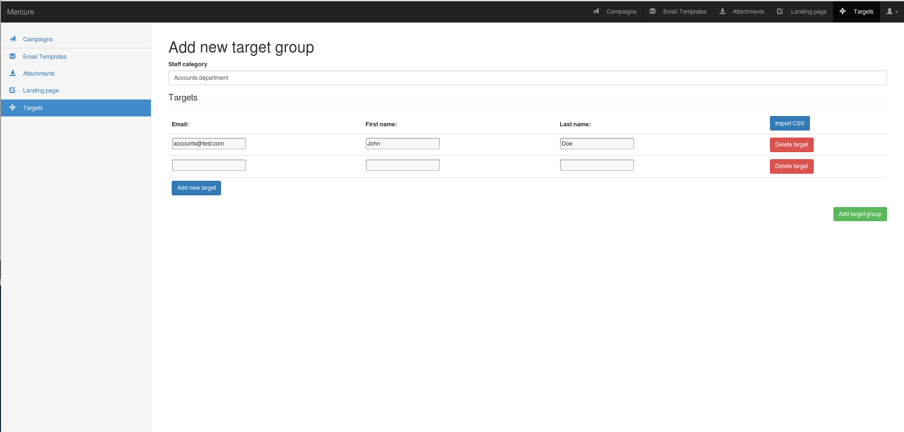
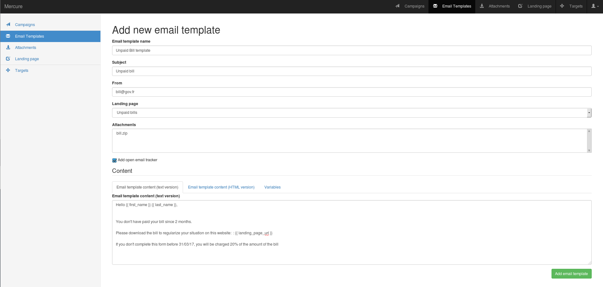
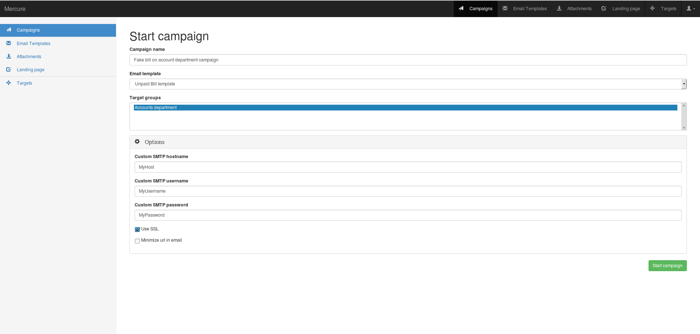
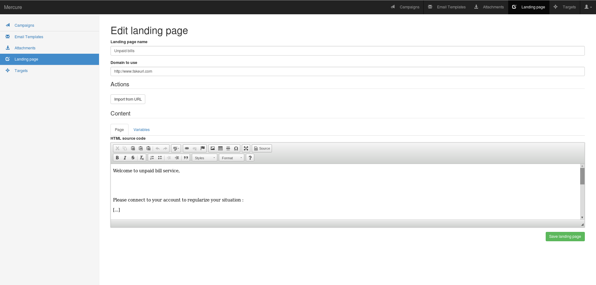
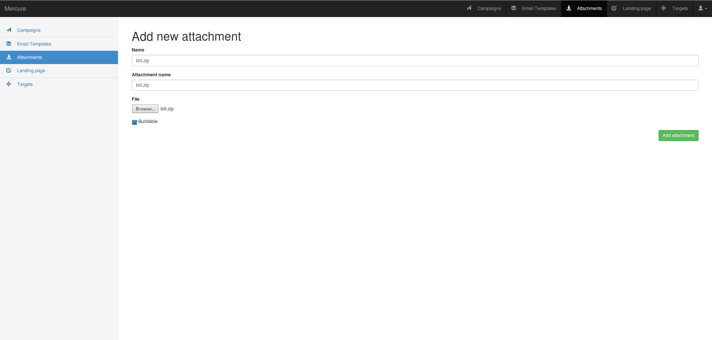

How to use mercure
==================

We can consider mercure is divide between 4 categories : \* Targets \*
Email Templates \* Attachments and landing page \* Campaigns

Targets, Email Templates and Campaign are the minimum required to run a
basic phishing campaign.

1. First, add your targets

   Targets

You need to fill mercure name, the target email.Target first and last
name are optional, but can be usefull to the landing page

2. Then, fill the email template.

   Landing page

You need to fill the mercure name, the subject, the send and the email
content. To improve the email quality, you have to fill the email
content HTML and the text content. To get information about opened
email, check "Add open email tracker" You can be helped with "Variables"
category.

Attachments and landing page are optionnal, we will see it after.

3. Finally, launch the campaign

   Campaign

You need to fill the mercure name, select the email template and the
target group. You can select the SMTP credentials, SSL using or URL
minimazing

4. Optional, add landing page

   Landing page

You need to fill the mercure name, the domain to use You can use "Import
from URL" to copy an existing website.

You have to fill the page content with text and HTML content by clicking
to "Source"

5. Optional, add Attachment

   Attachments

You need to fill the mercure name, the file name which appears in the
email and the file You also have to check if the the file is buildable
or not, if you need to compute a file for example.

To execute the build , you need to create a zip archive which contain a
build script (named 'generator.sh' and a buildable file
